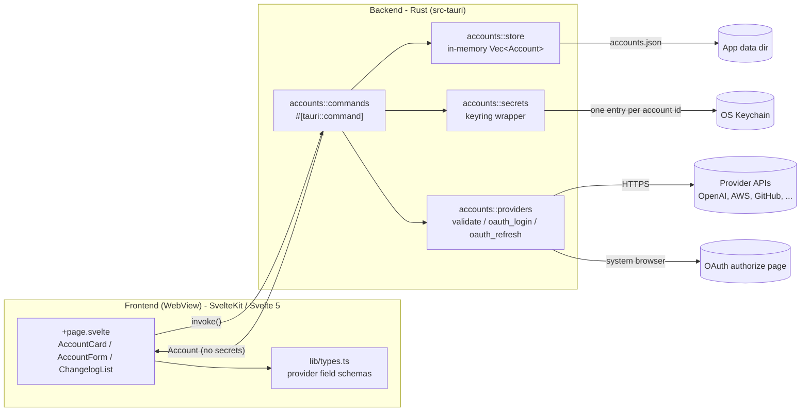
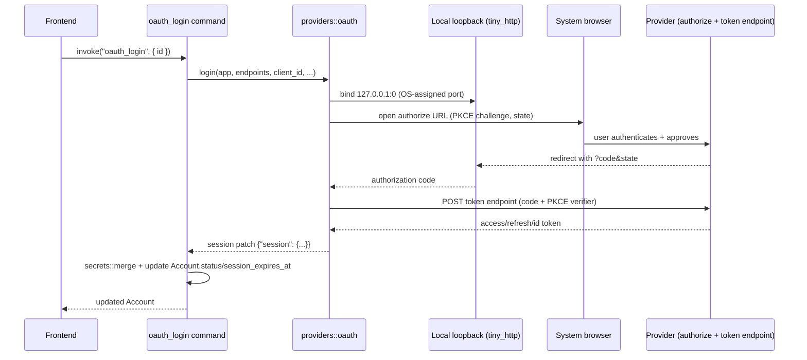

# Architecture

## System overview

my-companion is a Tauri 2 app: a native window hosting a SvelteKit frontend, backed by a Rust process that owns all account data and every network call. The frontend never talks to a provider's API, a keychain, or the filesystem directly - it only ever calls Tauri commands.



## The secrets boundary

This is the single most important design decision in the app: **secret values never cross into the frontend.**

- `Account` (the struct returned by every command) holds only non-secret metadata - `id`, `category`, `provider`, `name`, a `config` object, and status fields. See [`src-tauri/src/accounts/model.rs`](../src-tauri/src/accounts/model.rs).
- Secret values (API keys, tokens, OAuth client secrets, session tokens) live only in the OS keychain, read and written exclusively by [`accounts::secrets`](../src-tauri/src/accounts/secrets.rs). No Tauri command ever returns a secret to the frontend - not even on edit (the edit form re-enters secrets rather than displaying the old one).
- The frontend's `create`/`update` calls *send* secret values in, but never receive them back out.

See [`SECURITY.md`](SECURITY.md) for the full threat-model rationale.

## Why `config`/`secret` are untyped JSON

Rather than a Rust enum per provider (`OpenAiConfig`, `AwsConfig`, ...), `Account.config` and every secret payload are plain `serde_json::Value`. The frontend's [`PROVIDER_SCHEMAS`](../src/lib/types.ts) is the single source of truth for what fields a provider needs; Rust just stores and forwards whatever JSON it's given, and each provider module pulls the specific keys it needs out of that JSON at the point of use (`required_str`/`optional_str` helpers in `providers/mod.rs`).

This means adding a new provider never requires changing the `Account` model, the storage layer, or the Tauri command signatures - only a new `providers/<name>.rs` module and a schema entry in `types.ts`. See [`DEVELOPMENT.md`](DEVELOPMENT.md#adding-a-new-provider) for the concrete steps.

## Module layout

```
src-tauri/src/
  lib.rs                    Tauri app setup, command registration
  accounts/
    mod.rs                  wires the submodules together, init_state()
    model.rs                Account, AccountCategory, AccountStatus, Create/UpdateAccountInput
    store.rs                accounts.json persistence, AccountsState (Mutex<Vec<Account>>)
    secrets.rs               keyring wrapper: set / get / merge / delete
    commands.rs              #[tauri::command] functions - the only public API surface
    providers/
      mod.rs                 validate() / oauth_login() / oauth_refresh() dispatch by provider name
      oauth.rs                shared PKCE + loopback-listener + token-exchange machinery
      oidc.rs, gitlab.rs, github.rs, atlassian.rs, jira.rs, confluence.rs
      openai.rs, anthropic.rs, aws.rs, azure.rs, gcp.rs, scaleway.rs, kubeconfig.rs

src/
  routes/+page.svelte        top-level nav (Accounts/History), category tabs, account list
  lib/
    types.ts                 Account/provider types + PROVIDER_SCHEMAS (drives the dynamic form)
    accounts.ts               invoke() wrappers
    changelog.ts               parses CHANGELOG.md (bundled via a Vite ?raw import) for History
    components/
      AccountCard.svelte       one account: status, test/edit/delete/sign-in/refresh
      AccountForm.svelte       add/edit modal, built dynamically from PROVIDER_SCHEMAS
      ChangelogList.svelte     renders parsed release history
```

## Storage

Two separate stores, both keyed by the account's `id` (a UUID):

- **Metadata** - a single JSON file at `<app data dir>/accounts.json`, loaded into an in-memory `Mutex<Vec<Account>>` at startup ([`store::load`](../src-tauri/src/accounts/store.rs)) and rewritten in full on every create/update/delete ([`store::save`](../src-tauri/src/accounts/store.rs)). Fine at the scale this app deals with (tens of accounts, not thousands).
- **Secrets** - the OS keychain (`keyring` crate; Keychain on macOS), one entry per account under the service name `com.brun_s.my-companion.accounts`. [`secrets::merge`](../src-tauri/src/accounts/secrets.rs) does a shallow merge so an OAuth login can add a `session` sub-object without disturbing a stored `client_secret`.

## Command surface

Every command lives in [`accounts::commands`](../src-tauri/src/accounts/commands.rs) and is registered in [`lib.rs`](../src-tauri/src/lib.rs):

| Command | Purpose |
|---|---|
| `list_accounts` | Returns all accounts (metadata only). |
| `create_account` | Creates an account; stores its secret (if any) in the keychain. |
| `update_account` | Updates name/config, optionally replaces the secret; resets status to `unknown`. |
| `delete_account` | Removes both the metadata entry and its keychain secret. |
| `test_account` | Runs the provider's live validation call, updates `status`/`last_error`. |
| `oauth_login` | Runs the authorization-code + PKCE browser flow for an OAuth-capable account. |
| `refresh_oauth_session` | Refreshes a stored OAuth session using its refresh token. |

## The OAuth flow

Five providers support interactive sign-in: generic OIDC, GitLab, GitHub, Jira, and Confluence (see [`PROVIDERS.md`](PROVIDERS.md) for which ones also offer a plain-token alternative). They all share one implementation, [`providers::oauth`](../src-tauri/src/accounts/providers/oauth.rs), parameterized on an `Endpoints` struct - either discovered from a `.well-known/openid-configuration` document (generic OIDC, GitLab) or hardcoded (GitHub, Atlassian, which don't publish one).



The listener accepts exactly one request (or times out after 5 minutes), validates the `state` parameter to guard against CSRF, and is torn down immediately after - it only exists for the duration of a single sign-in.

## Frontend architecture

SvelteKit in static-adapter (SPA) mode - `ssr` is disabled (Tauri has no Node server to render against), so the whole app is one client-rendered page. Svelte 5 runes (`$state`, `$derived`, `$effect`) throughout, no external state management library.

`lib/types.ts` is the frontend's equivalent of the backend's provider dispatch: `PROVIDER_SCHEMAS` declares every provider's fields (and, where relevant, its `authMethods`), and `AccountForm.svelte` renders itself entirely from that data rather than having a bespoke form per provider.
